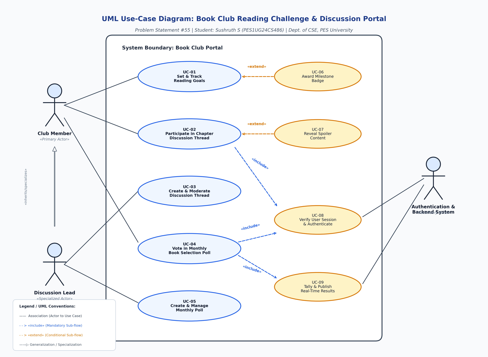

# Lab 1: Requirements Engineering & UML Use-Case Modelling

**Institution:** PES University — Department of Computer Science & Engineering  
**Course Code / Title:** Requirements Engineering & Object-Oriented Software Design Lab  
**Problem Statement #55:** Book Club Reading Challenge & Discussion Portal  
**Domain:** Media, Events & Community  

### Student Details
- **Student Name:** Sushruth S  
- **SRN:** PES1UG24CS486  
- **Branch / Dept:** Computer Science and Engineering (CSE)  
- **Repository:** [Lab1_Activity_Sushruth_S_PES1UG24CS486](https://github.com/SushruthSukesh/Lab1_Activity_Sushruth_S_PES1UG24CS486)

---

## 📖 1. Problem Context & Overview

A community reading portal tracking personal reading page goals, facilitating spoiler-tagged chapter discussion threads, and running monthly voting polls for next book selection.

### Key Capabilities & Workflow:
1. **Personal Reading Goal Tracking:** Members set daily/monthly reading page targets, log completed pages, monitor visual progress indicators, and unlock gamified achievement badges.
2. **Spoiler-Tagged Chapter Discussion Threads:** Structured discussion spaces organized chapter-by-chapter where spoilers remain obscured until explicitly unmasked by the user or when the chapter is marked as completed. Discussion leads moderate threads and pin thought-provoking prompts.
3. **Democratic Monthly Book Selection Polls:** A transparent, tamper-proof polling system with real-time tally synchronization and strict duplicate-vote prevention.

### Target Stakeholders & Actors:
- **`Club Member` (Primary Actor):** Reads books, tracks daily page counts, participates in discussion threads, unlocks reading badges, and casts votes in monthly polls.
- **`Discussion Lead` (Specialized Actor):** A senior club member with specialized privileges to create chapter discussion threads, pin prompts, and moderate flagged comments.
- **`Authentication & Backend System` (Secondary Actor):** Handles user session verification, cryptographic hashing, atomic ballot writes, and real-time WebSocket score broadcasting.

---

## 📋 2. Deliverable 1: Complete Requirements Table

| Req ID | Type | Description | Priority | Acceptance Criteria | Rationale (Justification) | Comments / Technical Notes |
| :--- | :--- | :--- | :---: | :--- | :--- | :--- |
| **FR-001** | Functional | The system shall hide content inside spoiler-tagged discussion comments until the user explicitly clicks to reveal or marks that chapter as read. | **High** | **Pass:** Spoiler text masked with blur filter.<br>**Fail:** Spoiler content exposed in search preview. | Protects readers from inadvertent plot spoilers before finishing chapters. | Client-side CSS blur mask with persistent user read-state sync. |
| **FR-002** | Functional | The system shall track individual user reading progress by logging daily/monthly page count goals and updating progress percentage toward the active book challenge. | **High** | **Pass:** Progress bar and page counts increment immediately upon logging valid integer page entries.<br>**Fail:** Negative page numbers accepted or progress gauge fails to update. | Core gamification mechanic to motivate members to meet periodic community reading challenge goals. | Input validation bounds checked against total book page count; updates user dashboard asynchronously. |
| **FR-003** | Functional | The system shall allow Discussion Leads to create and moderate chapter-specific discussion threads with custom pinned discussion prompts. | **High** | **Pass:** Only verified Discussion Leads can pin/close threads or delete flagged inappropriate comments.<br>**Fail:** Regular members access moderation actions. | Facilitates structured, organized, and toxicity-free book analysis across chapters. | Enforced using Role-Based Access Control (RBAC) on backend moderation API endpoints. |
| **FR-004** | Functional | The system shall allow Club Members to cast exactly one vote in the active monthly book selection poll from a curated list of nominated titles. | **High** | **Pass:** Member successfully submits 1 vote with confirmation dialog, vote button locks post-submission.<br>**Fail:** Member submits multiple votes upon session refresh. | Ensures democratic, fair, and tamper-resistant book selection for upcoming reading cycles. | Guaranteed by unique compound database index (`UserID` + `PollID`) in persistence layer. |
| **FR-005** | Functional | The system shall award and display digital achievement badges on user profiles upon reaching predefined reading milestones (e.g., logging 500 pages, finishing 5 books). | **Medium** | **Pass:** Badge icon appears in user profile badge showcase within 5 seconds of milestone trigger.<br>**Fail:** Badge awarded without meeting prerequisite page/book criteria. | Gamifies reading engagement, fostering long-term member retention and recognition. | Triggered via asynchronous event-driven badge evaluation service upon reading goal update. |
| **NFR-001** | Non-Functional *(Performance & Security)* | Monthly poll voting results must prevent duplicate votes using user session verification and update tallies in real-time. | **High** | **Pass:** Benchmarking tests confirm target latency (&lt; 200 ms) and security standards (0 duplicate votes) under simulated peak load of 1,000 concurrent voters.<br>**Fail:** Duplicate vote accepted or latency exceeds 1.5 s. | Ensures poll integrity and provides instantaneous community feedback during high-traffic voting. | In-memory Redis cache for tally aggregation paired with atomic transactional database writes. |
| **NFR-002** | Non-Functional *(Security & Availability)* | The portal shall maintain 99.9% system availability during active challenge periods and encrypt all user credentials and private profile data using AES-256 / SHA-256. | **High** | **Pass:** System uptime log reflects &ge; 99.9% availability per month and penetration tests confirm zero plaintext PII leaks.<br>**Fail:** Monthly downtime &gt; 43.8 minutes or unencrypted sensitive fields detected. | Protects member privacy, prevents credential compromise, and guarantees uninterrupted service during challenge deadlines. | Enforces TLS 1.3 in transit, column-level AES-256 encryption at rest, and automated container health probes. |

---

## 📊 3. Deliverable 2: UML Use-Case Diagram



### Architectural Relationships Modeled:
- **Actors:**
  - `Club Member` (Primary Actor)
  - `Discussion Lead` (Specialized Actor via `«specializes»` generalization)
  - `Authentication & Backend System` (Secondary Actor)
- **Primary Use Cases:**
  - `UC-01: Set & Track Reading Goals`
  - `UC-02: Participate in Chapter Discussion Thread`
  - `UC-03: Create & Moderate Discussion Thread`
  - `UC-04: Vote in Monthly Book Selection Poll`
  - `UC-05: Create & Manage Monthly Poll`
- **Stereotype Relationships:**
  - `«extend»`: `UC-06: Award Milestone Badge` extends `UC-01: Set & Track Reading Goals` (Triggered on milestone goal condition).
  - `«extend»`: `UC-07: Reveal Spoiler Content` extends `UC-02: Participate in Chapter Discussion Thread` (Triggered conditionally on explicit user unmask click).
  - `«include»`: `UC-04: Vote in Monthly Book Selection Poll` includes `UC-08: Verify User Session & Authenticate` and `UC-09: Tally & Publish Real-Time Results`.
  - `«include»`: `UC-02: Participate in Chapter Discussion Thread` and `UC-03: Create & Moderate Discussion Thread` include `UC-08: Verify User Session & Authenticate`.

---

## 📑 4. Deliverable 3: Use-Case Flow Specification (UC-04)

### Metadata & Overview
- **Use Case ID:** `UC-04`
- **Use Case Name:** Vote in Monthly Book Selection Poll
- **Primary Actor:** `Club Member`
- **Secondary Actors:** `Authentication Service`, `Real-Time Poll Tally Engine`
- **Stereotypes:** `«include»` Session Verification (UC-08), `«include»` Real-Time Tally Update (UC-09)
- **Priority:** High

### Preconditions
1. Member has logged in with an active authenticated session.
2. A monthly book selection poll is currently active and open.
3. Member has not previously submitted a vote for the active poll cycle.

### Postconditions
1. Member's single ballot is permanently recorded in the database.
2. Aggregate vote counts update in real-time across all client interfaces.
3. Member's voting interface transitions to a locked, read-only confirmation state.

### Main Success Scenario (MSS)
1. **Navigate:** Club Member navigates to the "Monthly Book Selection" section on the portal.
2. **Fetch Standings:** System fetches nominated titles, synopsis summaries, and checks user voting eligibility.
3. **Display:** System displays nominee cards with radio buttons and deadline timer.
4. **Select Candidate:** Member selects their desired book candidate.
5. **Submit:** Member clicks the "Submit Vote" button.
6. **Prompt:** System prompts confirmation modal: *"Confirm vote for [Title]? This cannot be changed."*
7. **Confirm:** Member confirms the dialog.
8. **Validate & Write:** System verifies session (`«include»`) and performs an atomic write transaction.
9. **Update Tally:** System increments candidate count in cache (`«include»`) and broadcasts live WebSocket update.
10. **Acknowledge:** System displays *"Vote Recorded Successfully"* receipt and locks selection inputs.
11. **Termination:** Use case completes successfully.

### Alternate & Exceptional Flows
- **3a. Member Already Voted in Current Cycle:**
  - 3a1. System detects existing vote timestamp in user profile.
  - 3a2. System displays live results chart with message *"You have already voted in this cycle."*
  - 3a3. Voting inputs remain disabled. Use case terminates.
- **5a. Submission Attempt Without Selection:**
  - 5a1. Member clicks submit with no selection.
  - 5a2. System highlights nominee list with alert *"Please select a book before submitting."*
  - 5a3. Member selects a valid option and resumes at Step 5.
- **8a. Duplicate Submission Collision:**
  - 8a1. Database compound unique constraint (`UserID` + `PollID`) catches race-condition duplicate submit.
  - 8a2. System rolls back transaction, returns `HTTP 409 Conflict`, and displays warning.
  - 8a3. UI reloads in read-only results view. Use case terminates.
- **8b. Poll Closes During Interaction:**
  - 8b1. System checks timestamp and detects poll expiration.
  - 8b2. System rejects vote with notification *"Voting window has closed."*
  - 8b3. System redirects to final leaderboard. Use case terminates.

---

## 📂 5. Repository File Structure

```text
Lab1_Activity_Sushruth_S_PES1UG24CS486/
├── README.md                                    # Complete markdown documentation of all deliverables
├── Requirements_Table.md                        # Deliverable 1 Markdown Table
├── Requirements_Table.pdf                       # Deliverable 1 Formatted PDF
├── Use_Case_Diagram.png                         # Deliverable 2 High-Res Diagram Image
├── Use_Case_Diagram.pdf                         # Deliverable 2 PDF Export
├── Use_Case_Diagram.drawio                      # Deliverable 2 Draw.io XML Source
├── Use_Case_Diagram.puml                        # Deliverable 2 PlantUML Source
├── Use_Case_Flow_Specification.md               # Deliverable 3 Markdown Specification
├── Use_Case_Flow_Specification.pdf              # Deliverable 3 1-Page Formatted PDF
├── Lab1_Complete_Deliverables_PES1UG24CS486.pdf # Combined Master Deliverable Document (PDF)
└── scripts/
    ├── generate_diagram.py                      # Python generator for high-res diagram
    └── generate_pdfs.py                         # ReportLab generator for formatted PDFs
```
